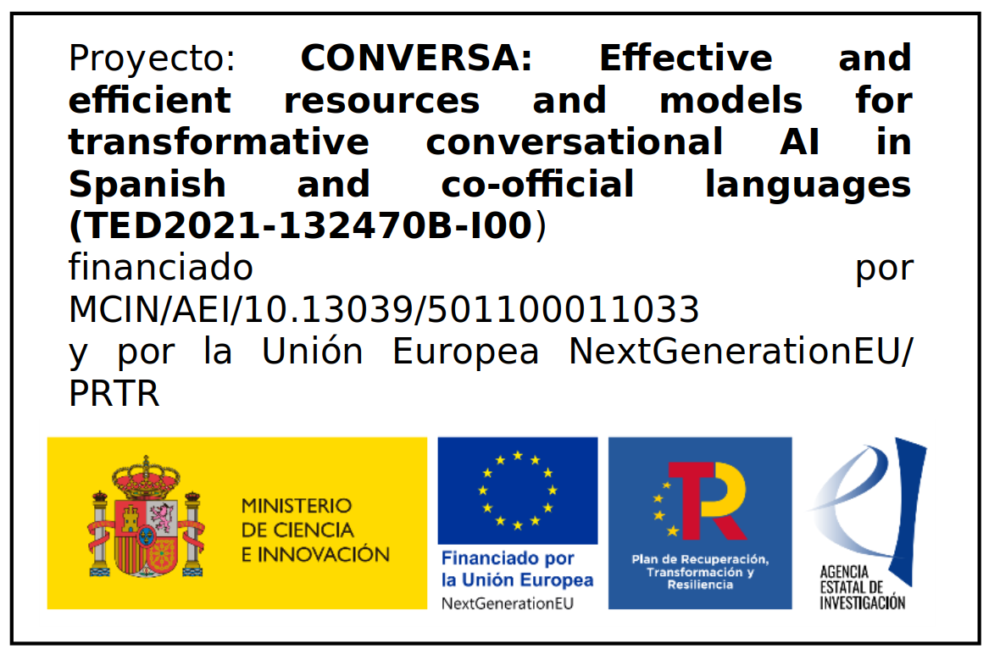

# CONVERSA project — EsCorpiusDialog

Access to information and services is increasingly conversational. However, there is a shortage of large-scale multi-turn conversational training data for Spanish and Spain’s co-official languages, both for general open-domain dialogue modelling and for downstream conversational applications. Additional barriers include the computational cost of training and the need for safety, transparency, and reproducibility.

The CONVERSA project (TED2021-132470B-I00) contributes open resources and tooling to democratize conversational AI for Spanish, Basque, Catalan, and Galician through data- and computation-efficient development, evaluation, and safety-oriented research. Project duration: December 2022 – November 2024.

Project description:
[Project description](https://drive.google.com/file/d/1nTvVLMz9zb7_VBXHkhmNSTrPmEPvPr3t/view?usp=sharing)

---

## EsCorpiusDialog: multilingual multi-turn dialogue corpus

EsCorpiusDialog is an open-domain, multi-turn dialogue dataset in Spanish and Spain’s co-official languages (Catalan, Basque, Galician). It aggregates dialogues from:
- Movie/TV subtitles (OpenSubtitles)
- Newsgroups (Usenet)
- Public forums (Menéame, Mediavida, Reddit)
- Books (Project Gutenberg)

The corpus is turn-segmented, with speaker attribution where available (forums + Usenet), and organized into language- and source-specific subsets under a unified schema.

### Public release note: forum data are dehydrated (metadata-only)
To align redistribution with platform Terms of Service and access policies, the public EsCorpiusDialog release distributes the forums subset in a dehydrated format:
- No raw forum text is redistributed.
- The release contains only identifiers and dialogue structure (thread/post IDs and ordered comment IDs defining root-to-leaf dialogue paths).
- Rehydration scripts are provided to reconstruct text by fetching it from the original platforms using these identifiers, under the user’s own credentials and compliance responsibility.

---

## Corpus scale (paper-aligned statistics)

Total (all sources):
- Dialogues: 30,518,397
- Turns: 129,705,492
- Tokens: 2,187,821,082
- Avg turns/dialogue: 4.3
- Total size: 13.8 GB

Language totals:
- Spanish (es): ~30.2M dialogues
- Catalan (ca): 92,009 dialogues
- Basque (eu): 115,796 dialogues
- Galician (gl): 63,098 dialogues

Source breakdown:
- OpenSubtitles: 20,254,311 dialogues; 96,887,581 turns; 988,899,395 tokens (4.1 GB)
  - ca: 91,945 dialogues; 419,620 turns; 5,129,052 tokens
  - gl: 63,098 dialogues; 284,504 turns; 2,906,273 tokens
  - eu: 115,796 dialogues; 533,753 turns; 6,104,836 tokens
  - es: 19,983,472 dialogues; 95,649,704 turns; 974,759,234 tokens
- Usenet (es): 494,928 dialogues; 1,799,788 turns; 292,366,955 tokens (4.1 GB)
- Forums (es, rehydrated scale): 9,756,293 dialogues; ~30.9M turns; 903,829,552 tokens (5.6 GB)
  - Public distribution: dehydrated identifiers + dialogue structure (no text)
- Gutenberg Dialogue:
  - Total: 12,865 dialogues; 95,325 turns; 2,725,180 tokens
  - ca: 64 dialogues; 463 turns; 10,153 tokens
  - es: 12,801 dialogues; 94,862 turns; 2,715,027 tokens

Notes:
- “Forums (rehydrated scale)” refers to the approximate size after reconstructing text from platforms; the distributed artifact is dehydrated (ID-only).
- Speakers are available (recoverable without identity disclosure) for Usenet and forums; OpenSubtitles and Gutenberg do not include speaker attribution.

---

## Source-specific notes and code

### OpenSubtitles (ChatSubs)
We previously released ChatSubs, a subtitles-derived dialogue corpus in Spanish and co-official languages (Data in Brief, 2023).
- Data: [Zenodo](https://zenodo.org/record/8220853)
- Code: [conversa-ai/ChatSubs](https://github.com/conversa-ai/ChatSubs)

### Usenet
We processed Spanish-speaking Usenet newsgroups into multi-turn dialogues using message threading (Message-ID / References).
- Code: [conversa-ai/process_usenet](https://github.com/conversa-ai/process_usenet)

### Forums (Menéame, Mediavida, Reddit) — dehydrated release + rehydration
Forum threads are represented as trees (root post + nested replies). Dialogues are extracted as root-to-leaf paths.
Public release is dehydrated; rehydration scripts reconstruct text by platform access:

- Mediavida rehydration:
  
  Repository: [conversa-ai/processMediavida](https://github.com/conversa-ai/processMediavida)
  
  Command:
  ```
  python3 rehydrate_mediavida.py --input data/mediavida_dialogue_ids_v1.json --output output/mediavida_rehydrated.json --user-agent "esCorpiusDialog-rehydration/1.0 (research; contact: zoraida@ugr.es)" --sleep 1.0 --timeout 30
  ```

- Menéame rehydration:
  
  Repository: [conversa-ai/processMeneame](https://github.com/conversa-ai/processMeneame)
  
  Command:
  ```
  python3 rehydrate_meneame.py --input data/meneame_dialogue_ids_v1.json --output output/meneame_rehydrated.json --user-agent "esCorpiusDialog-rehydration/1.0 (research; contact: zoraida@ugr.es)" --sleep 1.0 --timeout 30 --retries 3 --replace-mentions
  ```

- Reddit rehydration (OAuth):
  
  Repository: [conversa-ai/processReddit](https://github.com/conversa-ai/processReddit)
  
  Command:
  ```
  python3 rehydrate_reddit_dialogues_oauth.py --input data/reddit_dialogue_ids_v1.json --output output/reddit_rehydrated.json --client-id "$REDDIT_CLIENT_ID" --client-secret "$REDDIT_CLIENT_SECRET" --username "$REDDIT_USERNAME" --password "$REDDIT_PASSWORD" --user-agent "esCorpiusDialog-rehydration/1.0 (research; contact: zoraida@ugr.es)" --sleep 1.0 --chunk-size 100 --timeout 30
  ```

Important:
- Users must comply with each platform’s Terms of Service, robots policies, and API rate limits when rehydrating.
- The project does not grant additional rights beyond what platforms allow; compliance is the user’s responsibility.

### Books (Project Gutenberg)
We used the Gutenberg Dialogue extraction pipeline (Csáky & Recski, 2021) to extract Spanish and Catalan dialogue from Gutenberg books.
- Tooling reference: [ricsinaruto/gutenberg-dialog](https://github.com/ricsinaruto/gutenberg-dialog)

---

## Tools and open access
We develop and maintain tools to:
- collect, normalize, and export dialogue data for LLM training,
- track data sources at scale and preserve provenance,
- reproduce the pipeline and enable extension to additional sources/languages.

Code is maintained under the Conversa-AI GitHub organization:
[conversa-ai](https://github.com/conversa-ai)

---

## Safety and bias: esCorpiusBias

We additionally released esCorpiusBias, a context-aware Spanish forum dataset annotated for sexism and racism/xenophobia, designed to study how conversational context affects toxicity/bias detection.

Core characteristics:
- Source: Mediavida forum threads represented as reply trees; dialogues are extracted as root-to-leaf paths.
- Annotation unit: a 3-turn window (target comment + two preceding turns) to capture context-dependent bias (sarcasm, quotes, escalation).
- Labels: operational guidelines were developed for sexism, racism/xenophobia, homophobia, and aporophobia; modeling focuses on sexism and racism due to sparsity of the other categories.
- Dataset size (final annotated benchmarks):
  - Sexism: 1,001 dialogs (22.1% positive), Cohen’s kappa 0.55
  - Racism: 989 dialogs (30.2% positive), Cohen’s kappa 0.79
- Modeling: single-turn vs contextualized variants; baselines include TF–IDF LogReg, SpaCy TextCatBOW, and transformer-based BETO within SpaCy.

Citation:
Kharitonova, K., Pérez-Fernández, D., Gutiérrez-Hernando, J., Gutiérrez-Fandiño, A., Callejas, Z., & Griol, D. (2025).
EsCorpiusBias: The Contextual Annotation and Transformer-Based Detection of Racism and Sexism in Spanish Dialogue.
Future Internet, 17(8), 340. https://doi.org/10.3390/fi17080340

---

## Dialogue systems and evidence-grounded QA
We also develop dialogue and QA systems in diverse domains. As a demonstrator, we built an evidence-grounded QA system over clinical guideline content using Retrieval-Augmented Generation (RAG).

Paper:
Kharitonova, K., Pérez-Fernández, D., Gutiérrez-Hernando, J., Gutiérrez-Fandiño, A., Callejas, Z., & Griol, D. (2024).
Incorporating evidence into mental health Q&A: a novel method to use generative language models for validated clinical content extraction.
Behaviour & Information Technology. https://doi.org/10.1080/0144929X.2024.2321959

---

## References
1. Kharitonova, K., Callejas, Z., Pérez-Fernández, D., Gutiérrez-Fandiño, A., & Griol, D. (2023).
   ChatSubs: A dataset of dialogues in Spanish, Catalan, Basque and Galician extracted from movie subtitles for developing advanced conversational models.
   Data in Brief, 50, 109565. https://doi.org/10.1016/j.dib.2023.109565

2. Kharitonova, K., Pérez-Fernández, D., Gutiérrez-Hernando, J., Gutiérrez-Fandiño, A., Callejas, Z., & Griol, D. (2024).
   Incorporating evidence into mental health Q&A: a novel method to use generative language models for validated clinical content extraction.
   Behaviour & Information Technology. https://doi.org/10.1080/0144929X.2024.2321959

3. Kharitonova, K., Pérez-Fernández, D., Gutiérrez-Hernando, J., Gutiérrez-Fandiño, A., Callejas, Z., & Griol, D. (2025).
   EsCorpiusBias: The Contextual Annotation and Transformer-Based Detection of Racism and Sexism in Spanish Dialogue.
   Future Internet, 17(8), 340. https://doi.org/10.3390/fi17080340


